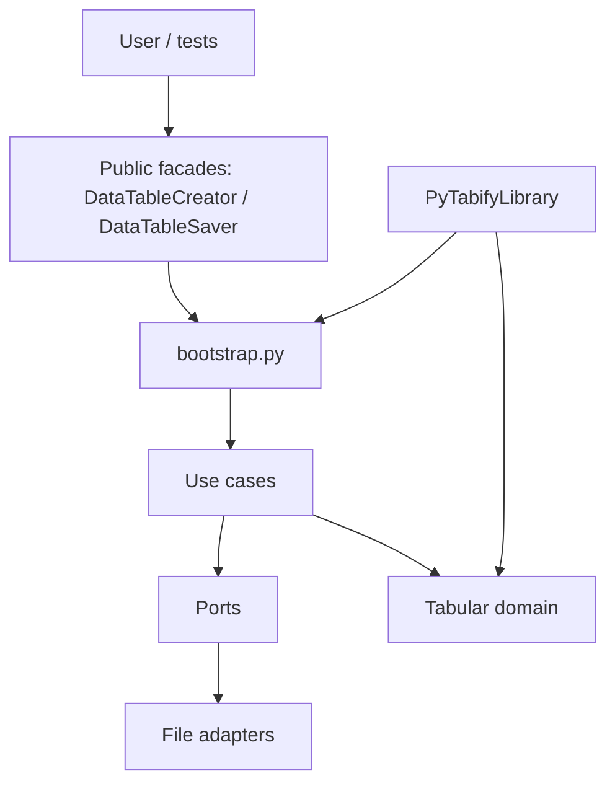
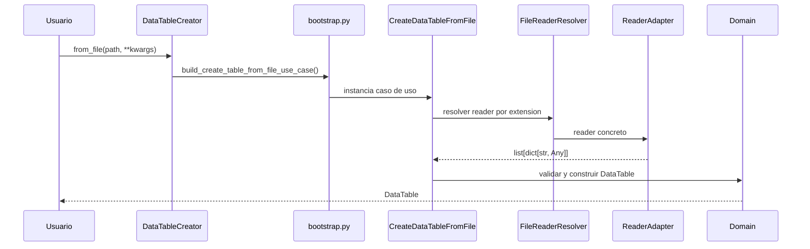
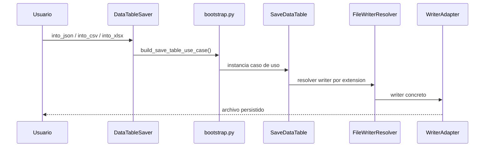

# Architecture

!!! info "For maintainers"
    This page explains the public API's internal composition and where new adapters fit. It is unnecessary for ordinary package use.

## Overview



## Main components

| Component | Responsibility |
| --- | --- |
| `creator.py` | Public entry point for tables from files or records |
| `saver.py` | Public entry point for saving tables |
| `bootstrap.py` | Compose use cases with concrete resolvers |
| `application/use_cases` | Orchestrate loading and saving |
| `application/ports` | Reader, writer and resolver contracts |
| `domain` | DataTable, rows, fields and tabular validation |
| `adapters/files/readers` | CSV, JSON and XLSX reading |
| `adapters/files/writers` | CSV, JSON and XLSX writing |
| `robot/` | Official Robot wrapper and row/table adapters |

## Main data flow

### Load from a file



### Save



## Design boundaries

- The domain stays independent of files and concrete formats.
- Formats belong in adapters and resolvers.
- Public facades stay small and expose user intent rather than infrastructure details.
- Adapters convert external data into simple structures; tabular validation stays centralized in the domain.
- Resolvers select by extension, so path extensions must match actual formats.

## Robot Framework integration

PyTabifyLibrary reuses the same use cases and wraps native tables in RobotDataTable and RobotDataRow. It avoids duplicated business logic and keeps Python and Robot contracts consistent.

## Extend or maintain the library

1. Add a concrete reader/writer under `adapters/files` and register it in the resolver.
2. Keep reader output as `list[dict[str, Any]]`.
3. Preserve public entry points through DataTableCreator and DataTableSaver.
4. Avoid moving validation into adapters or adding overly specific facade methods.
5. Keep end-to-end tests aligned with the public API.
6. Decide whether new behavior belongs in domain, application or adapters.

For tabular contract changes, review domain tests and public examples. For format changes, review resolver, adapter and a round-trip. For public API changes, review Python, Robot and documentation.

```python title="Actual use case composition" hl_lines="8 12 16"
from pytabify.adapters.files.resolvers import FileReaderResolver, FileWriterResolver
from pytabify.application.use_cases.create_data_table_from_file import CreateDataTableFromFile
from pytabify.application.use_cases.create_data_table_from_records import CreateDataTableFromRecords
from pytabify.application.use_cases.save_data_table import SaveDataTable


def build_create_table_from_file_use_case() -> CreateDataTableFromFile:
    return CreateDataTableFromFile(reader_resolver=FileReaderResolver())


def build_create_table_from_records_use_case() -> CreateDataTableFromRecords:
    return CreateDataTableFromRecords()


def build_save_table_use_case() -> SaveDataTable:
    return SaveDataTable(writer_resolver=FileWriterResolver())
```

!!! warning "Protect the separation"
    Adapters deciding business rules or the domain depending on concrete formats break the architecture.

[Extending formats](extending-readers-writers.md){ .md-button .md-button--primary }
