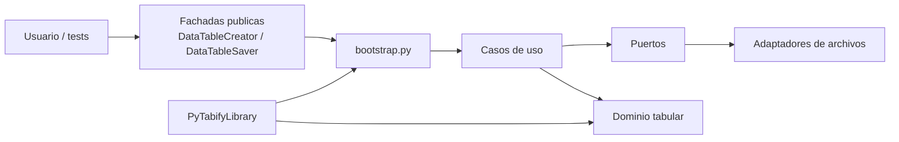
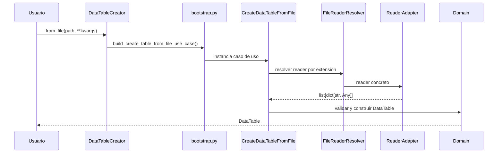
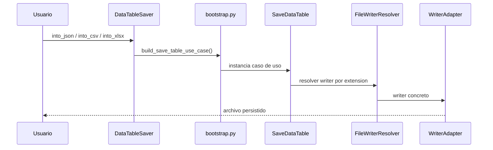

# Arquitectura

!!! info "Solo si vas a extender la libreria"
    Para usar `pytabify` no necesitas esta pagina. Esta seccion existe para entender como se compone internamente la API publica y donde encajan nuevos adaptadores.

## Vista general



## Componentes principales

| Componente | Responsabilidad |
| --- | --- |
| `creator.py` | entrada publica para crear `DataTable` desde archivo o registros |
| `saver.py` | entrada publica para persistir `DataTable` |
| `bootstrap.py` | compone casos de uso con resolvers concretos |
| `application/use_cases` | orquesta los flujos de carga y guardado |
| `application/ports` | define contratos para readers, writers y resolvers |
| `domain` | define `DataTable`, filas, campos y validacion tabular |
| `adapters/files/readers` | implementa lectura para `CSV`, `JSON` y `XLSX` |
| `adapters/files/writers` | implementa escritura para `CSV`, `JSON` y `XLSX` |
| `robot/` | wrapper oficial y adaptadores para Robot Framework |

## Flujo de datos principal

### Carga desde archivo



### Persistencia



## Lo importante para no romper el diseno

<div class="grid cards" markdown>

-   __El dominio no depende de archivos__

    `DataTable` y sus reglas siguen siendo independientes de CSV, JSON o Excel.

-   __Los formatos viven en adaptadores__

    Cambiar o agregar un formato afecta resolvers y adaptadores, no la API publica completa.

-   __Las fachadas deben seguir pequenas__

    `DataTableCreator` y `DataTableSaver` exponen intencion de uso, no detalles de infraestructura.

</div>

## Decisiones de diseño relevantes

!!! note "Fachadas publicas pequenas"
    La API publica se mantiene corta a proposito. `DataTableCreator` y `DataTableSaver` exponen intencion de uso y evitan que el consumidor dependa de adaptadores o resolvers concretos.

!!! note "Validacion centralizada en el dominio"
    Los adaptadores convierten datos externos a estructuras simples. La validacion del contrato tabular vive en el dominio, no repartida entre readers y writers.

!!! note "Resolucion por extension"
    La infraestructura decide readers y writers a partir de la extension del archivo. Eso simplifica el uso, pero obliga a que `path` sea coherente con el formato real.

## Donde entra Robot Framework

`PyTabifyLibrary` reutiliza los mismos casos de uso y envuelve la tabla nativa en `RobotDataTable` y `RobotDataRow`. Eso evita duplicar logica de negocio y mantiene un contrato coherente entre Python y Robot.

## Como extender o mantener la herramienta

### Extender formatos

1. Agrega un reader o writer concreto en `adapters/files/readers` o `adapters/files/writers`.
2. Registra el nuevo formato en el resolver correspondiente.
3. Mantén la salida del reader como `list[dict[str, Any]]`.
4. Verifica que la API publica siga entrando por `DataTableCreator` y `DataTableSaver`.

### Mantener el diseno

1. Evita mover logica de validacion al adaptador.
2. No hagas crecer las fachadas publicas con casos demasiado especificos.
3. Mantén los tests end-to-end alineados con la API publica, no con detalles internos.
4. Si agregas un nuevo flujo, decide primero si pertenece a `domain`, `application` o `adapters`.

??? info "Checklist corto para mantenedores"
    - Si cambias el contrato tabular, revisa dominio, tests unitarios y ejemplos publicos.
    - Si cambias un formato, revisa resolver, adaptador y al menos un round-trip.
    - Si cambias la API publica, revisa Python, Robot Framework y documentacion.

```python title="Composicion interna real de casos de uso"
from pytabify.adapters.files.resolvers import FileReaderResolver, FileWriterResolver
from pytabify.application.use_cases.create_data_table_from_file import CreateDataTableFromFile
from pytabify.application.use_cases.create_data_table_from_records import CreateDataTableFromRecords
from pytabify.application.use_cases.save_data_table import SaveDataTable


def build_create_table_from_file_use_case() -> CreateDataTableFromFile:
    return CreateDataTableFromFile(reader_resolver=FileReaderResolver())


def build_create_table_from_records_use_case() -> CreateDataTableFromRecords:
    return CreateDataTableFromRecords()


def build_save_table_use_case() -> SaveDataTable:
    return SaveDataTable(writer_resolver=FileWriterResolver())
```

!!! warning "Cambio de arquitectura que suele degradar el proyecto"
    Si un adaptador empieza a decidir reglas de negocio o el dominio empieza a depender de formatos concretos, la separacion actual se rompe rapido. Ese es el principal limite a proteger en mantenimiento.

[Extender formatos](extending-readers-writers.md){ .md-button .md-button--primary }
