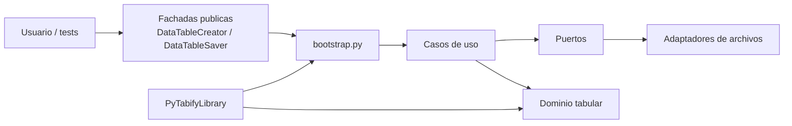

# Arquitectura

!!! info "Solo si vas a extender la libreria"
    Para usar `pytabify` no necesitas esta pagina. Esta seccion existe para entender como se compone internamente la API publica y donde encajan nuevos adaptadores.

## Vista general

## Responsabilidades por capa

| Capa | Responsabilidad |
| --- | --- |
| `domain` | contrato tabular, filas, campos, validacion y reglas base |
| `application` | puertos y casos de uso |
| `adapters` | lectura, escritura y resolucion por formato |
| `creator.py` y `saver.py` | fachada publica enfocada en casos de uso |
| `robot/` | adaptadores y wrapper para Robot Framework |
| `bootstrap.py` | composicion entre casos de uso y resolvers |

## Lo importante para no romper el diseno

-   __El dominio no depende de archivos__

    `DataTable` y sus reglas siguen siendo independientes de CSV, JSON o Excel.

-   __Los formatos viven en adaptadores__

    Cambiar o agregar un formato afecta resolvers y adaptadores, no la API publica completa.

-   __Las fachadas deben seguir pequenas__

    `DataTableCreator` y `DataTableSaver` exponen intencion de uso, no detalles de infraestructura.

## Donde entra Robot Framework

`PyTabifyLibrary` reutiliza los mismos casos de uso y envuelve la tabla nativa en `RobotDataTable` y `RobotDataRow`. Eso evita duplicar logica de negocio y mantiene un contrato coherente entre Python y Robot.
